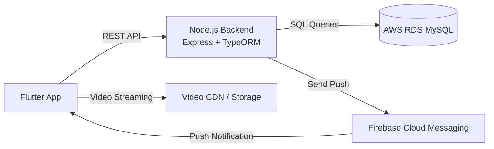

# StreamSync Lite 

StreamSync Lite is a complete mobile learning application built using **Flutter**, **Node.js**, **TypeORM**, and **AWS RDS**.  
The app provides **authentication**, **video streaming**, **playback resume**, **offline support**, and **push notifications** via **Firebase Cloud Messaging (FCM)**.

---

## 📁 Project Structure

```text
StreamSync-Lite/
│
├── frontend/
│   ├── lib/
│   ├── android/
│   ├── ios/
│   └── pubspec.yaml
│
├── backend/
│   ├── src/
│   │   ├── main.ts
│   │   ├── data-source.ts
│   │   └── entities/
│   ├── package.json
│   ├── tsconfig.json
│   ├── Dockerfile
│   └── .env.example
│
└── README.md
```

---

## 🖼 Architecture Diagram



---

## 🌐 Live Backend URL

```text
http://35.173.184.177:3000/
```

### 🔍 Health Check

```bash
GET /health
```

---


### 🖼 Screenshots

```markdown


```

---

## 🔐 Environment Configuration

Check the ".env.example" file in "/backend/"

All configurations are listed there, Just copy paste inside your ".env" file

---

## 🐳 Backend Dockerfile

```dockerfile
FROM node:18-alpine

WORKDIR /app

COPY package*.json ./
RUN npm install

COPY . .

RUN npm run build

EXPOSE 3000

CMD ["node", "dist/main.js"]
```

---

## 🚀 Backend Deployment (AWS EC2)

### 1️⃣ SSH into your instance

```bash
ssh -i aws_login2.pem ubuntu@35.173.184.177
```

### 2️⃣ Install Node.js & Git

```bash
sudo apt update
sudo apt install -y git nodejs npm
```

### 3️⃣ Clone repository

```bash
git clone https://github.com/Mr-Srinu/StreamSync-Lite.git
cd StreamSync-Lite/backend
```

### 4️⃣ Install dependencies

```bash
npm install
```

### 5️⃣ Create `.env`

```bash
nano .env
```

Paste environment variables and save.

### 6️⃣ Build backend

```bash
npm run build
```

### 7️⃣ Run backend with PM2 (background mode)

```bash
sudo npm install -g pm2
pm2 start dist/main.js --name streamsync
pm2 save
pm2 startup
```

---

## 🛢 AWS RDS Setup

1. Create a **MySQL RDS** instance in AWS.
2. Allow inbound access from your **EC2 security group**.
3. Initialize database:

   ```bash
   mysql -h streamsync.c278q6wy89gb.us-east-1.rds.amazonaws.com -u admin -p
   ```

   Inside MySQL:

   ```sql
   CREATE DATABASE streamsync;
   ```

TypeORM will generate tables automatically on first run (if configured).

---

## 📱 Frontend Setup (Flutter)

### 1️⃣ Update API Base URL

In `lib/services/api_client.dart`:

```dart
const String kApiBaseUrl = 'http://35.173.184.177';
```

### 2️⃣ Install dependencies

```bash
flutter pub get
```

### 3️⃣ Build APK

```bash
flutter build apk
```

(You can find the APK in `build/app/outputs/flutter-apk/`.)

---

## 🔔 Push Notification (FCM) Setup

1. Add **Firebase** to the Flutter app (Android config).
2. Add `google-services.json` to `android/app/`.
3. Put **FCM server key** inside backend `.env` (`FCM_SERVER_KEY`).
4. App sends FCM token to backend on login/launch.
5. Test push endpoint:

   ```bash
   POST /notifications/send-test
   ```

---

## 🧪 API Endpoints

### 🔑 Authentication

```bash
POST /auth/register
POST /auth/login
```

### 🎞 Videos

```bash
GET  /videos
POST /videos/progress
```

### 🔔 Notifications

```bash
GET    /notifications/:userId
POST   /notifications/send-test
DELETE /notifications/:id
```

### ❤️ Health Check

```bash
GET /health
```

---

## 🔗 Demo Links 

# Demo Video

https://drive.google.com/file/d/1oV6MYJtOfCd1965HMVssfWyKS7yQPdJI/view?usp=drivesdk

# Backend URL

http://35.173.184.177:3000/

# Screen shots

https://github.com/Mr-Srinu/StreamSync-Lite/tree/main/Screenshots

---

---

